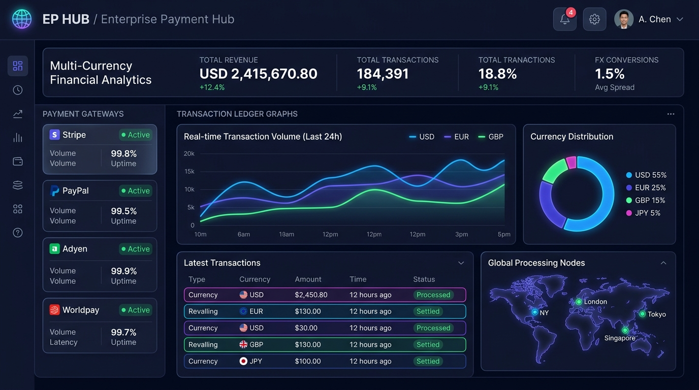
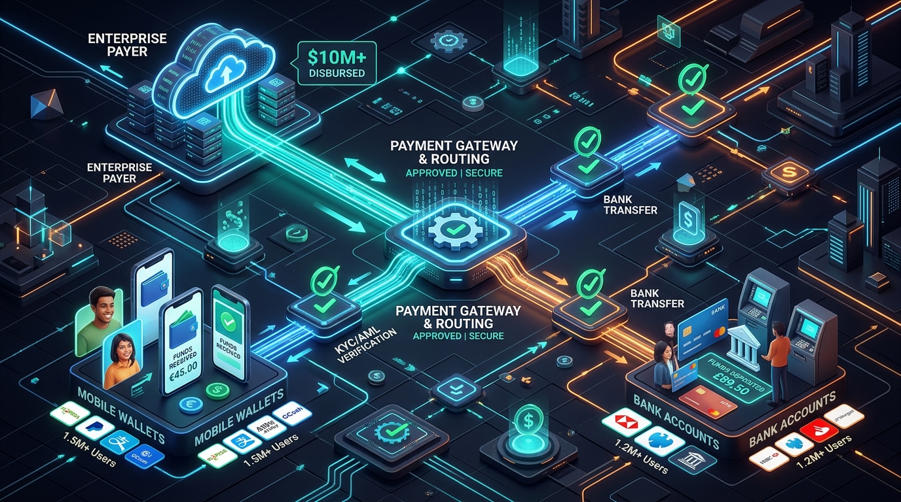

# 💳 PayHub Gateway & Gmail Disbursement PWA

[](https://react.dev/)
[](https://www.typescriptlang.org/)
[](https://tailwindcss.com/)
[](https://vitejs.dev/)
[](https://developers.google.com/gmail/api)
[](https://developer.mozilla.org/en-US/docs/Web/API/SubtleCrypto)
[](https://web.dev/progressive-web-apps/)

**PayHub Gateway & Gmail Disbursement PWA** is an enterprise-grade Progressive Web Application (PWA) combining global credit/debit card processing with Bangladeshi Mobile Financial Services (MFS) disbursements and automated Google Workspace Gmail API receipt delivery.

PayHub unites **Stripe**, **bKash B2C Direct Payout**, and **Nagad Cryptographic Disbursement** into a unified dashboard with transaction ledgers, analytics, client-side cryptographic security (RSA-OAEP & HMAC-SHA256), and dynamic Gmail label tagging.

<p align="center">
  
  <br />
  <em>✨ PayHub Enterprise Fintech Dashboard — Multi-Gateway Payouts & Automated Gmail Receipts</em>
</p>

---

## 📑 Table of Contents

- [Overview & Architecture](#-overview--architecture)
- [Feature Highlights](#-feature-highlights)
  - [1. Stripe International Card Gateway](#1-stripe-international-card-gateway)
  - [2. bKash B2C Direct Disbursement](#2-bkash-b2c-direct-disbursement)
  - [3. Nagad Payout with RSA Encryption](#3-nagad-payout-with-rsa-encryption)
  - [4. Gmail Automated Receipts & Dynamic Label Hub](#4-gmail-automated-receipts--dynamic-label-hub)
  - [5. Real-Time Transaction Ledger & Audit Trail](#5-real-time-transaction-ledger--audit-trail)
  - [6. Progressive Web App (PWA) & Bilingual Interface](#6-progressive-web-app-pwa--bilingual-interface)
- [Security & Cryptography](#-security--cryptography)
  - [RSA-OAEP 2048-bit Public Key Encryption](#rsa-oaep-2048-bit-public-key-encryption)
  - [HMAC-SHA256 Merchant Signatures](#hmac-sha256-merchant-signatures)
  - [Idempotency Guard](#idempotency-guard)
  - [Client-Side Google Workspace OAuth2](#client-side-google-workspace-oauth2)
- [Configuration Requirements](#-configuration-requirements)
  - [Google Workspace & Gmail OAuth Scopes](#google-workspace--gmail-oauth-scopes)
  - [Payment Gateway Credentials](#payment-gateway-credentials)
- [Setup & Installation Instructions](#-setup--installation-instructions)
- [Gateway Label Manager API Reference](#-gateway-label-manager-api-reference)
- [Project Directory Structure](#-project-directory-structure)
- [NPM Scripts](#-npm-scripts)
- [License](#-license)

---

## 🏛️ Overview & Architecture

Modern businesses frequently need to collect international payments while disbursing funds to local contractors, vendors, or affiliates via local mobile wallets (e.g. bKash, Nagad). Keeping transaction records and notifying recipients with proper receipts is often fragmented.

PayHub solves this by providing:
1. **Multi-rail Payment & Payout Engine**: Accepts global cards via Stripe and executes B2C payouts via bKash and Nagad.
2. **Automated Receipt Automation**: Sends branded, responsive HTML transaction receipts through the authenticated user's Gmail account via the official Google Workspace Gmail REST API.
3. **Dynamic Gmail Label Management**: Automatically fetches existing Gmail labels, creates custom nested folders with color badges, and tags emails into gateway-specific folders (e.g. `Payments/bKash`, `Payments/Nagad`, `Payments/Stripe`).
4. **Resilient Local Persistence**: Atomic key storage, gateway lookup tables, and multi-tab synchronization via browser events.
5. **Zero Server Secrets Exposure**: Pure client-side OAuth2 authentication and Web Crypto API cryptographic operations.

---

## 🚀 Feature Highlights

### 1. Stripe International Card Gateway
* **Card Processing**: Supports Visa, MasterCard, American Express, and Discover.
* **Multi-Currency**: Process charges in `USD`, `EUR`, `GBP`, and `BDT`.
* **Luhn Algorithm Validation**: Real-time client-side card format, expiry date, and CVC validation.
* **Simulated 3D Secure (3DS)**: Emulates real-world bank authorization flows and tokenization.
* **Idempotency Protection**: Every transaction includes an idempotency key preventing duplicate billing.

### 2. bKash B2C Direct Disbursement

<p align="center">
  
  <br />
  <em>💸 High-Speed B2C Disbursement Flow — Enterprise Payout to Mobile Financial Wallets</em>
</p>

* **Mobile Number Validation**: Validates Bangladeshi MSISDN formats (`01[3-9]XXXXXXXX` or `8801[3-9]XXXXXXXX`).
* **Tokenized Grant Flow**: Implements `getBkashToken` with client-side caching and refresh cycle.
* **Disbursement Execution**: Generates unique `paymentID`, `trxID`, merchant invoice references, and timestamped audit logs.
* **Custom Notes**: Supports payment intent tracking and disbursement memos.

### 3. Nagad Payout with RSA Encryption
* **Cryptographic Payload Encryption**: Encrypts sensitive payout parameters using **RSA-OAEP 2048-bit** public key encryption.
* **HMAC-SHA256 Merchant Signatures**: Signs outgoing request payloads with the merchant's secret key using the standard Web Crypto API (`window.crypto.subtle`).
* **Response Verification**: Confirms response signature integrity to prevent tampering or replay attacks.
* **Issuer Payment Reference**: Full simulation of Nagad B2C merchant payout API endpoints.

### 4. Gmail Automated Receipts & Dynamic Label Hub

<p align="center">
  
  <br />
  <em>📬 Automated Gmail Dispatch & Dynamic Label Routing for Payment Receipts</em>
</p>

* **Google Workspace OAuth2**: Client-side authentication using official Google identity services.
* **Auto-Fetch on Mount**: Automatically discovers user labels upon component initialization when a valid token is present.
* **Dynamic Label Picker**: Interactive selectable list allowing users to map labels directly to Stripe, bKash, or Nagad with live search and category tabs (`All`, `Custom`, `System`).
* **1-Click Standard Provisioning**: Creates standard hierarchical Gmail folders (`Payments/bKash`, `Payments/Nagad`, `Payments/Stripe`) with predefined brand colors.
* **Custom Nested Labels**: Direct creation of Gmail sub-folders (using forward slashes, e.g. `Payments/Affiliates`) with 12 Google palette color badges.
* **Automated Tagging**: Auto-applies mapped labels to outgoing email receipts using `gmail.users.messages.batchModify` or thread labels.
* **Branded HTML Receipts**: Clean, mobile-responsive email receipts with invoice numbers, gateway badges, breakdown tables, and audit timestamps.

### 5. Real-Time Transaction Ledger & Audit Trail
* **Recharts 30-Day Disbursement Analytics**: Interactive timeline chart visualizing daily payout amounts per gateway (bKash, Nagad, Stripe) over the last 30 calendar days, with Area/Bar mode toggles, gateway isolation tabs, and continuous zero-fill timelines.
* **60-Second Auto-Refresh & Background Polling**: Automatic service layer polling every 60 seconds with live countdown timer (`60s -> 0s`), toggle switch, pulsing indicator, and multi-tab `storage` event synchronization.
* **Interactive Statistics**: Live KPI cards for total volume, total transactions, disbursement ratio, and receipt delivery rates.
* **Advanced Filtering & Search**: Instant filtering by gateway (`All`, `Stripe`, `bKash`, `Nagad`), transaction type (`Disbursement`, `Payment Received`), and status (`Completed`, `Pending`, `Failed`).
* **Exporting Capabilities**:
  * **CSV Export**: Standard comma-separated spreadsheet with full transaction metadata.
  * **JSON Export**: Formatted JSON data dump for auditing or backup.
* **Transaction Detail Modal**: Complete breakdown of payload metadata, idempotency keys, and a manual "Re-send Receipt" action.

### 6. Progressive Web App (PWA) & Bilingual Interface
* **PWA Compliance**: Offline support with service worker (`sw.js`), manifest, and app icons for installation on iOS, Android, macOS, and Windows.
* **Bilingual UI**: Instant 1-click toggle between **English** and **Bengali (বাংলা)** across all views, alerts, and forms.
* **Enterprise Dark Theme**: High-contrast, accessibility-tested palette styled with Tailwind CSS v4 and Lucide React icons.

---

## 🔐 Security & Cryptography

<p align="center">
  
  <br />
  <em>🔒 Enterprise Security Architecture — RSA-OAEP 2048-bit Public Key Encryption & HMAC-SHA256 Integrity</em>
</p>

PayHub implements robust security principles across network operations, state persistence, and cryptographic signing:

```text
┌────────────────────────────────────────────────────────┐
│                   PayHub Security Flow                 │
├─────────────────────────┬──────────────────────────────┤
│ 1. Input Validation     │ Strict MSISDN, Card, & Labels│
│ 2. Web Crypto Signatures│ HMAC-SHA256 (SubtleCrypto)   │
│ 3. Payload Encryption   │ RSA-OAEP 2048-bit Public Key │
│ 4. Idempotency Guard    │ Unique UUID per Transaction  │
│ 5. OAuth Token Security │ Client-Only Scoped Bearer    │
└─────────────────────────┴──────────────────────────────┘
```

### RSA-OAEP 2048-bit Public Key Encryption
Nagad B2C payouts require payload encryption with the merchant's RSA public key. PayHub implements this using the browser's native **Web Crypto API** (`SubtleCrypto`):
* **Format**: X.509 PKCS#1 SubjectPublicKeyInfo PEM string (`NAGAD_DEFAULT_CREDENTIALS.publicKeyPem`).
* **Algorithm**: `RSA-OAEP` with `SHA-256` digest hashing.
* **Payload Enclosure**: Sensitive fields (receiver MSISDN, merchant invoice, amount, and timestamp) are converted to a cryptographic cipher block before transmission.

### HMAC-SHA256 Merchant Signatures
To guarantee that disbursement requests are not altered in transit:
```typescript
const signatureBase = `${merchantId}${amount}${invoiceNo}`;
const cryptoKey = await window.crypto.subtle.importKey(
  'raw',
  keyData,
  { name: 'HMAC', hash: 'SHA-256' },
  false,
  ['sign']
);
const signatureBuffer = await window.crypto.subtle.sign('HMAC', cryptoKey, messageData);
```
Responses are similarly checked using `verifyNagadResponseSignature` to validate authenticity.

### Idempotency Guard
To eliminate accidental double-charges or duplicate payouts caused by rapid clicks or network retries, every transaction generates a cryptographic `idempotencyKey` UUID. Subsequent attempts with the same key are identified and safely deduplicated.

### Client-Side Google Workspace OAuth2
* No Google client secret is ever stored or exposed in the frontend bundle.
* The access token is stored securely in runtime memory and browser storage with expiration tracking.
* Only the minimal required OAuth scopes are requested.

---

## ⚙️ Configuration Requirements

### Google Workspace & Gmail OAuth Scopes
To enable Gmail automated receipts and label management, your Google Cloud OAuth Client requires the following scopes:

| Scope | Purpose |
| :--- | :--- |
| `https://www.googleapis.com/auth/gmail.send` | Dispatches branded HTML transaction receipts to customer emails |
| `https://www.googleapis.com/auth/gmail.labels` | Fetches user labels and creates custom nested payment folders |
| `https://www.googleapis.com/auth/gmail.modify` | Automatically attaches label badges to sent receipts |
| `https://www.googleapis.com/auth/userinfo.email` | Displays the authenticated merchant profile in the header |

### Payment Gateway Credentials
PayHub includes sandbox/test credentials out of the box for testing:
* **Stripe**: Simulated test mode with standard 4242 test cards.
* **bKash Sandbox**: Merchant App Key `bkash_app_key_sandbox_9921` and username `merchant_live_user`.
* **Nagad Sandbox**: Merchant ID `NAGAD_MCH_88201`, Secret Key `NAGAD_LIVE_SEC_KEY_SECRET_78912`, and 2048-bit RSA Public Key PEM.

---

## 💻 Setup & Installation Instructions

### Prerequisites
* **Node.js**: v18.0.0 or higher
* **npm**: v9.0.0 or higher (or `pnpm` / `yarn`)

### 1. Clone the Repository
```bash
git clone https://github.com/your-org/payhub-gateway-gmail-pwa.git
cd payhub-gateway-gmail-pwa
```

### 2. Install Dependencies
```bash
npm install
```

### 3. Start the Development Server
```bash
npm run dev
```
The application will boot on **`http://localhost:3000`** with Hot Module Replacement (HMR).

### 4. Build for Production
```bash
npm run build
```
Generates an optimized production bundle in the `dist/` folder with Workbox PWA service worker precaching.

### 5. Preview Production Build
```bash
npm run preview
```

---

## 📚 Gateway Label Manager API Reference

The label manager service (`src/services/gmail/labelManager.service.ts`) provides clean, type-safe functions for gateway mapping:

### `saveGatewayLabelMapping(gateway, labelId)`
Validates input and saves the label mapping to `localStorage` under both atomic and structured keys.
```typescript
import { saveGatewayLabelMapping } from './services/gmail/labelManager.service';

// Persists bKash disbursement label
saveGatewayLabelMapping('BKASH', 'Payments/bKash');
```

### `getMappedLabelForGateway(gateway, type?)`
Resolves the active Gmail label for a gateway with fallback to canonical defaults (`Payments/Received` for Stripe, `Payments/Disbursed` for bKash/Nagad).
```typescript
import { getMappedLabelForGateway } from './services/gmail/labelManager.service';

const label = getMappedLabelForGateway('STRIPE');
// Returns user-mapped label or 'Payments/Received'
```

### `clearGatewayMappings(gateway?)`
Resets label configurations back to defaults. Supports resetting an individual gateway or clearing all gateways.
```typescript
import { clearGatewayMappings } from './services/gmail/labelManager.service';

// Reset all gateways to system defaults
clearGatewayMappings();

// Or reset only Nagad
clearGatewayMappings('NAGAD');
```

### `isValidGatewayKey(gateway)` & `isValidLabelId(labelId)`
Runtime validation guards preventing corrupt or unsupported keys from writing to persistent storage.

---

## 📁 Project Directory Structure

```text
├── index.html                   # HTML entry point with PWA meta tags & title
├── metadata.json                # AI Studio application metadata
├── package.json                 # Project scripts and dependencies
├── vite.config.ts               # Vite configuration with PWA plugin & aliases
├── public/                      # Static assets, icons, and web manifest
└── src/
    ├── App.tsx                  # Main layout, routing, header, and language switch
    ├── index.css                # Tailwind CSS v4 directives & theme styles
    ├── main.tsx                 # React DOM mount point
    ├── types/
    │   └── index.ts             # TypeScript definitions (Gateways, Receipts, Transactions)
    ├── components/
    │   ├── DisbursementForm.tsx # Stripe / bKash / Nagad unified payment form
    │   ├── GmailHub.tsx         # Gmail OAuth, Label Picker, Settings & Sent Receipts
    │   ├── StatsOverview.tsx    # KPI statistics cards & disbursement volume metrics
    │   ├── TransactionList.tsx  # Filterable transaction ledger with CSV/JSON export
    │   └── TransactionDetailModal.tsx # Detailed transaction audit modal & re-sender
    ├── services/
    │   ├── bkash/
    │   │   └── bkash.service.ts # bKash B2C tokenization & payout engine
    │   ├── gmail/
    │   │   ├── auth.ts          # Google Workspace OAuth token management
    │   │   ├── gmail.service.ts # Gmail REST API message encoding & dispatch
    │   │   └── labelManager.service.ts # Gateway label mapping, validation & storage
    │   ├── ledger/
    │   │   └── ledger.service.ts# In-memory and local storage transaction ledger
    │   ├── nagad/
    │   │   └── nagad.service.ts # Nagad payout, RSA-OAEP encryption & HMAC-SHA256
    │   └── stripe/
    │       └── stripe.service.ts# Stripe card processing, 3DS simulation & Luhn check
    └── utils/
        └── exportUtils.ts       # CSV and formatted JSON export helpers
```

---

## 🛠️ NPM Scripts

| Script | Command | Description |
| :--- | :--- | :--- |
| `npm run dev` | `vite --port=3000 --host=0.0.0.0` | Starts local development server on port 3000 |
| `npm run build` | `vite build` | Compiles TypeScript and creates production bundle |
| `npm run preview` | `vite preview` | Locally serves the production `dist/` directory |
| `npm run lint` | `tsc --noEmit` | Runs TypeScript type checking without emitting files |
| `npm run clean` | `rm -rf dist server.js` | Cleans previous build artifacts |

---

## 📄 License

This project is licensed under the **MIT License**. You are free to use, modify, and distribute this software for personal and commercial applications.

---

<p align="center">
  Built with ❤️ using React 19, Tailwind CSS v4, Google Workspace Gmail API & Web Crypto.
</p>
